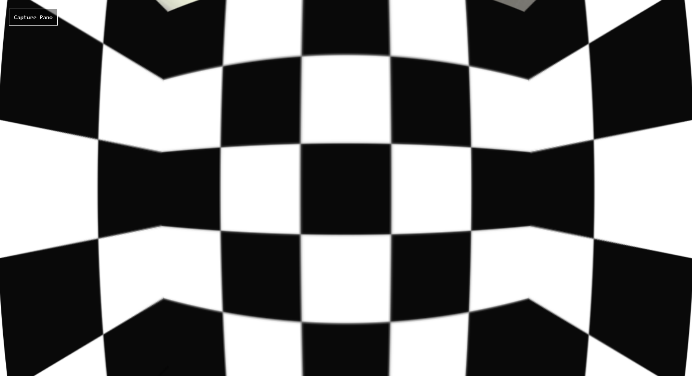
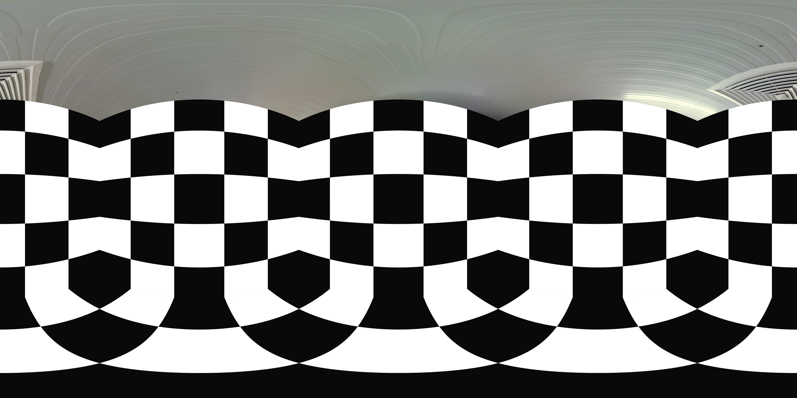
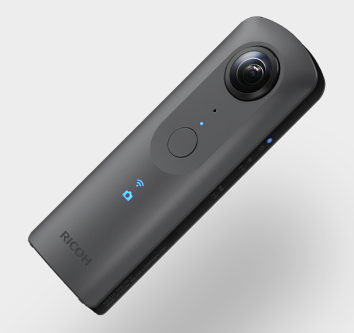
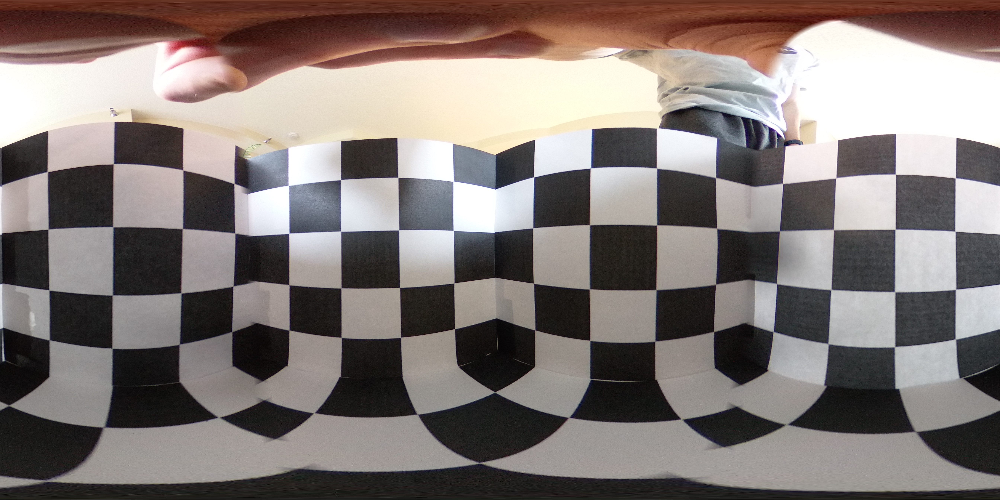
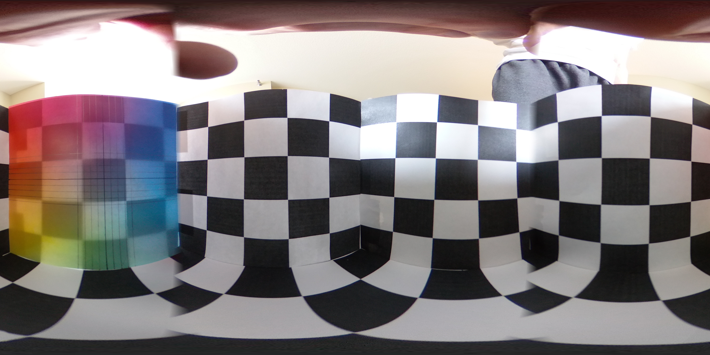
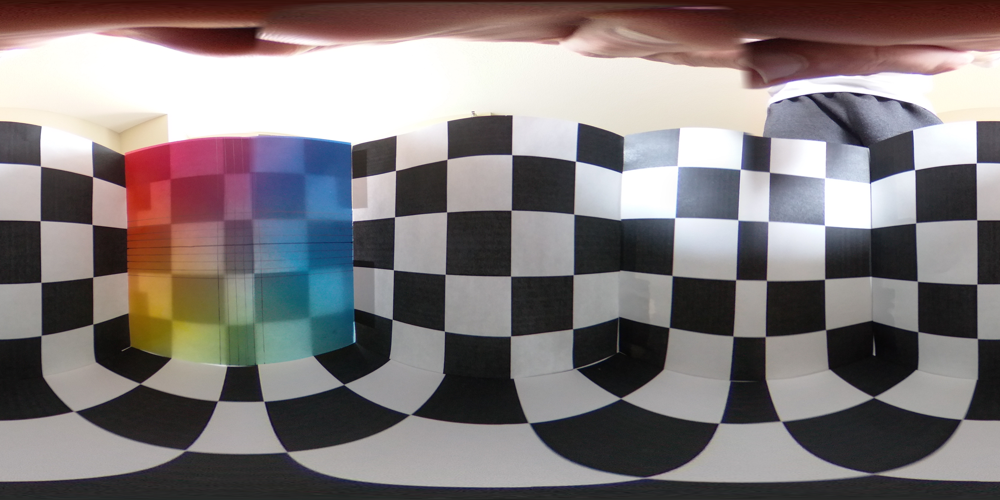
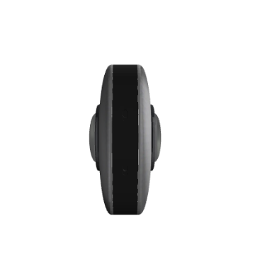
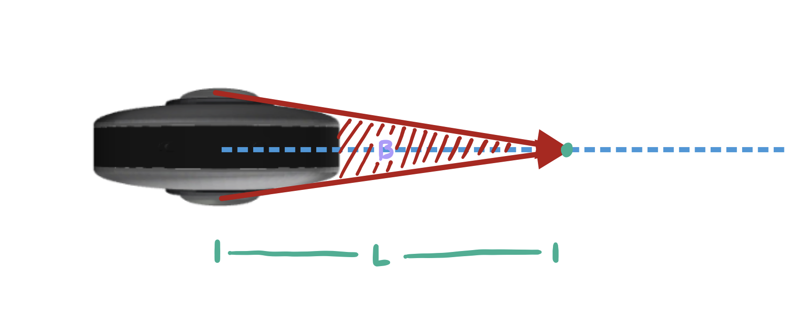

# Three.js 360 Camera Simulation

### Code

The goal of this project is to simulate the usage and properties of a physical 360 camera within a three.js environment. The code uses a modified version of the [THREE.CubemapToEquirectangular](https://github.com/spite/THREE.CubemapToEquirectangular) library, with a couple key changes: 1. the library has been adapted to be a module so it can be imported like any of the Three example code 2. it has been updated to function in three.js version 139 (the original library has not had support for 5+ years).

`index.html` shows an example scene and usage of the module with a simple test environment also used by our physical tests. The viewer will show a view like this with a regular wide-angle camera (140 degrees vertical FOV)

  

When the `Capture Pano` button is pressed, a second three scene and camera setup will be created in the background, and a `CubeCamera` will capture an environmental cubemap image to a buffer. A GLSL textureCube is used to translate the fragment locations to a plane of the camera size. Finally, an orthographic camera captures the plane and downloads the image, resulting in an equirectangular image like so:

### Physical Camera Tests

  

Our testing involved a [Ricoh Theta V 360 Camera](https://theta360.com/en/about/theta/v.html), which uses two wide-angle fisheye lenses on either side of the camera package. Testing was done to determine the stitching algorithm and physical characteristics of the lenses - an example image is shown below. 

As can be seen in the image, down the center of two of the faces the squares fail to retain a correct aspect ratio. It was determined that this issue is due to a blind spot between the two lenses, which can be seen more clearly when the blind spot is pointed at more complicated areas:

Another example comparing clear view to camera vs. blindspot area:

*Center vertical line missing from image*

This has been found to be a result of an intrinsic property of the camera: that the lenses exist some non-zero distance apart from each other, as can be seen from above:

  

In this space between the two lenses, and extending perpendicularly outward, there is a zone where the two lenses' field-of-views do not reach each other, resulting in the blind spot seen in the images. The software attempts to compensate by slightly overlapping the edges of each camera's image, and therefore we see ghosting in the captured images. However, this effect seems to be almost mitigated at a distance of <DISTANCE>, and thus it becomes clear that the lenses are actually slightly higher than 180 degree FOV. The following image demonstrates this phenomenon:

Because of the distance between the two lenses, there exists a triangular blindspot `B` up to a distance `L` from the center of the lenses. At distance `L` the FOVs of the lenses perfectly meet, effectively avoiding this issue. It should also be noted that beyond this distance the lenses FOVs begin to overlap, resulting in other ghosting issues which can be seen in specific cases.

Further testing is needed to determine a more precise distance for the blindspot, and also to potentially study the effects at longer distances. However, the characteristics found here give a solid understanding of the imperfections of this physical 360 degree camera.